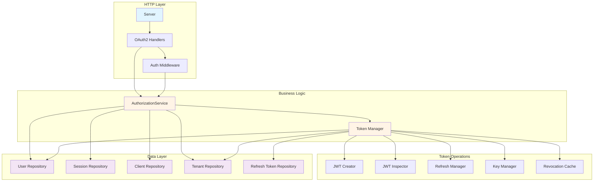
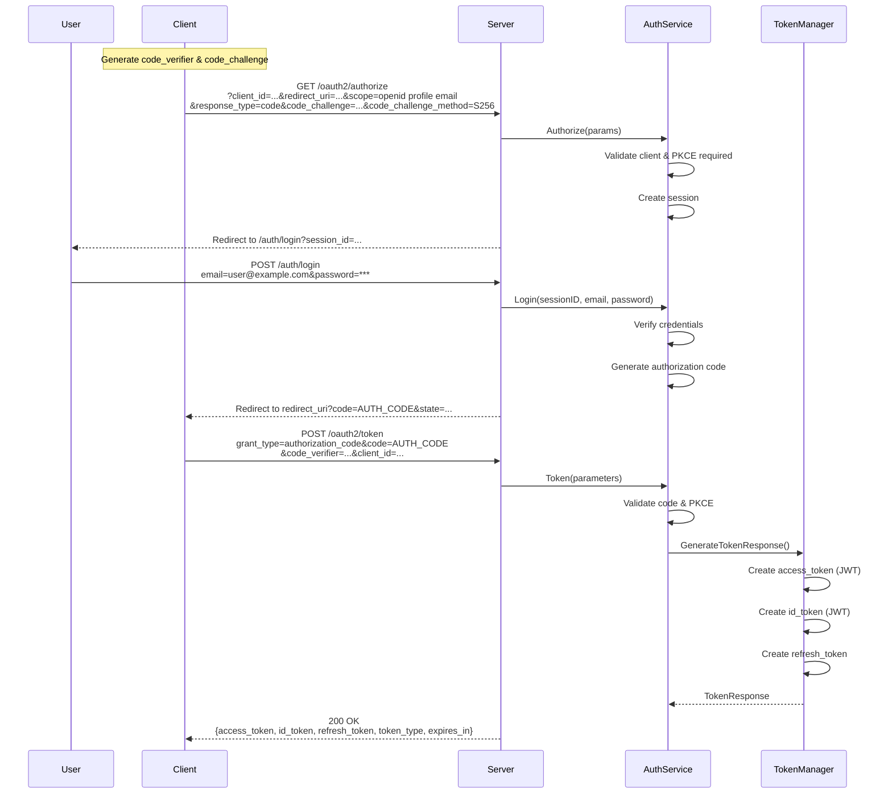
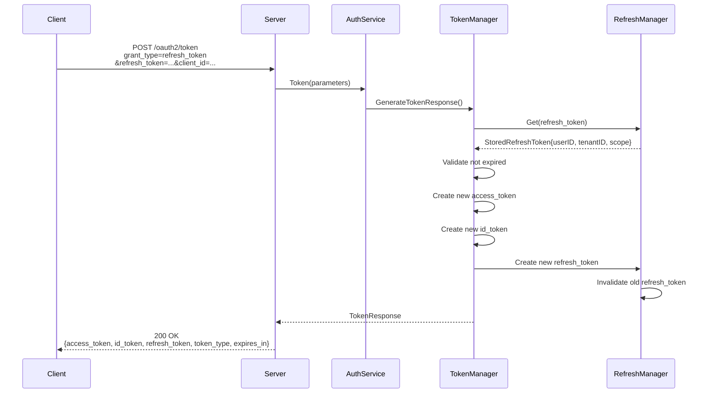
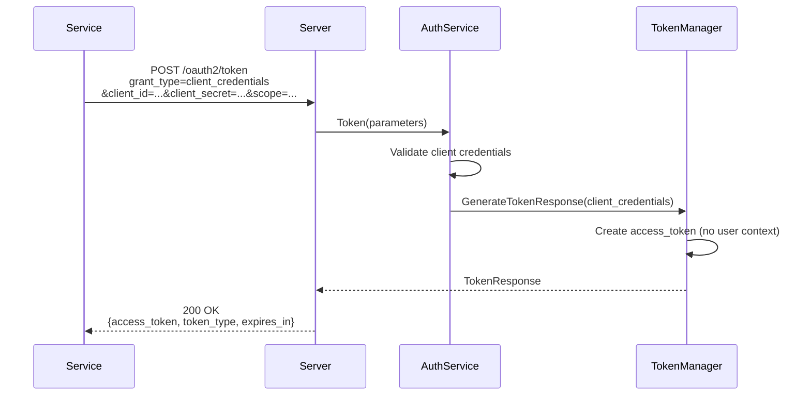
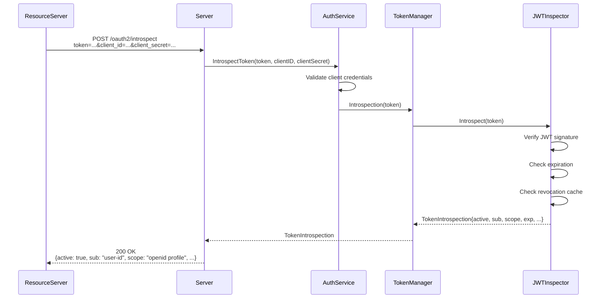

# 🔐 Go OAuth Service

[](https://goreportcard.com/report/github.com/jrsteele09/go-oauth-service)
[](https://godoc.org/github.com/jrsteele09/go-oauth-service)
[](https://opensource.org/licenses/MIT)

> **⚠️ Work in Progress**: This project is under active development and is not yet ready.

A multi-tenant **OAuth2** and **OpenID Connect (OIDC)** server implementation written in Go. This library provides the core business logic for OAuth2 authorization flows without HTTP endpoints, allowing you to integrate it with any web framework of your choice.

## Architecture

The service follows a clean, layered architecture with clear separation of concerns:

### Core Components



### OAuth2 Authorization Code Flow (with PKCE)



### Token Refresh Flow



### Client Credentials Flow



### Token Validation & Introspection



## OAuth2/OIDC HTTP Endpoints

### Discovery & Public Key Endpoints

#### `GET /.well-known/openid-configuration`
**OpenID Connect Discovery Document**

Returns the OIDC provider configuration metadata.

**Response:**
```json
{
  "issuer": "https://your-domain.com",
  "authorization_endpoint": "https://your-domain.com/oauth2/authorize",
  "token_endpoint": "https://your-domain.com/oauth2/token",
  "userinfo_endpoint": "https://your-domain.com/userinfo",
  "jwks_uri": "https://your-domain.com/.well-known/jwks.json",
  "revocation_endpoint": "https://your-domain.com/oauth2/revoke",
  "introspection_endpoint": "https://your-domain.com/oauth2/introspect",
  "end_session_endpoint": "https://your-domain.com/oauth2/logout",
  "response_types_supported": ["code"],
  "response_modes_supported": ["query"],
  "subject_types_supported": ["public"],
  "id_token_signing_alg_values_supported": ["RS256"],
  "scopes_supported": [
    "openid",
    "profile",
    "email",
    "offline_access",
    "admin",
    "system:admin"
  ],
  "token_endpoint_auth_methods_supported": [
    "client_secret_post",
    "none"
  ],
  "grant_types_supported": [
    "authorization_code",
    "refresh_token",
    "client_credentials"
  ],
  "code_challenge_methods_supported": ["S256", "plain"],
  "claims_supported": [
    "sub",
    "email",
    "email_verified",
    "given_name",
    "family_name",
    "preferred_username"
  ]
}
```

---

#### `GET /.well-known/jwks.json`
**JSON Web Key Set**

Returns the public keys used to verify JWT token signatures.

**Response:**
```json
{
  "keys": [
    {
      "kty": "RSA",
      "use": "sig",
      "kid": "tenant-123-key-1",
      "n": "0vx7agoebGcQSuuPiLJXZptN9nndrQmbXEps2aiAFbWhM78LhWx4...",
      "e": "AQAB"
    }
  ]
}
```

---

### Authorization & Authentication Endpoints

#### `GET /oauth2/authorize`
**OAuth2 Authorization Endpoint**

Initiates the authorization code flow.

**Query Parameters:**
| Parameter | Required | Description |
|-----------|----------|-------------|
| `client_id` | Yes | OAuth2 client identifier |
| `redirect_uri` | Yes | Where to redirect after authorization |
| `response_type` | Yes | Must be `code` |
| `scope` | Yes | Space-separated scopes (e.g., `openid profile email`) |
| `state` | Recommended | CSRF protection token |
| `code_challenge` | For public clients | PKCE code challenge (base64url-encoded SHA-256 hash) |
| `code_challenge_method` | For public clients | PKCE method: `S256` or `plain` |
| `nonce` | Optional | Included in ID token for replay protection |

**Example:**
```
GET /oauth2/authorize
  ?client_id=my-app
  &redirect_uri=https://myapp.com/callback
  &response_type=code
  &scope=openid profile email
  &state=random-state-value
  &code_challenge=E9Melhoa2OwvFrEMTJguCHaoeK1t8URWbuGJSstw-cM
  &code_challenge_method=S256
```

**Response:**
- Redirects to login page if user not authenticated
- Redirects to `redirect_uri` with authorization code if successful:
  ```
  https://myapp.com/callback?code=AUTH_CODE&state=random-state-value
  ```

---

#### `POST /oauth2/token`
**OAuth2 Token Endpoint**

Exchanges authorization code, refresh token, or client credentials for access tokens.

**Content-Type:** `application/x-www-form-urlencoded`

##### Authorization Code Grant

**Parameters:**
| Parameter | Required | Description |
|-----------|----------|-------------|
| `grant_type` | Yes | Must be `authorization_code` |
| `code` | Yes | Authorization code from `/oauth2/authorize` |
| `client_id` | Yes | OAuth2 client identifier |
| `client_secret` | For confidential clients | Client secret |
| `code_verifier` | For PKCE | Original random string used to generate code_challenge |
| `redirect_uri` | Yes | Must match authorization request |

**Example:**
```bash
curl -X POST https://your-domain.com/oauth2/token \
  -H "Content-Type: application/x-www-form-urlencoded" \
  -d "grant_type=authorization_code" \
  -d "code=AUTH_CODE" \
  -d "client_id=my-app" \
  -d "code_verifier=RANDOM_VERIFIER_STRING" \
  -d "redirect_uri=https://myapp.com/callback"
```

##### Refresh Token Grant

**Parameters:**
| Parameter | Required | Description |
|-----------|----------|-------------|
| `grant_type` | Yes | Must be `refresh_token` |
| `refresh_token` | Yes | Refresh token from previous token response |
| `client_id` | Yes | OAuth2 client identifier |
| `client_secret` | For confidential clients | Client secret |

**Example:**
```bash
curl -X POST https://your-domain.com/oauth2/token \
  -H "Content-Type: application/x-www-form-urlencoded" \
  -d "grant_type=refresh_token" \
  -d "refresh_token=REFRESH_TOKEN" \
  -d "client_id=my-app"
```

##### Client Credentials Grant

**Parameters:**
| Parameter | Required | Description |
|-----------|----------|-------------|
| `grant_type` | Yes | Must be `client_credentials` |
| `client_id` | Yes | OAuth2 client identifier |
| `client_secret` | Yes | Client secret |
| `scope` | Optional | Space-separated scopes |

**Example:**
```bash
curl -X POST https://your-domain.com/oauth2/token \
  -H "Content-Type: application/x-www-form-urlencoded" \
  -d "grant_type=client_credentials" \
  -d "client_id=service-app" \
  -d "client_secret=CLIENT_SECRET" \
  -d "scope=admin"
```

**Success Response (200 OK):**
```json
{
  "access_token": "eyJhbGciOiJSUzI1NiIsInR5cCI6IkpXVCJ9...",
  "token_type": "Bearer",
  "expires_in": 3600,
  "refresh_token": "random-refresh-token-string",
  "id_token": "eyJhbGciOiJSUzI1NiIsInR5cCI6IkpXVCJ9...",
  "scope": "openid profile email"
}
```

**Error Response (400 Bad Request):**
```json
{
  "error": "invalid_grant",
  "error_description": "Authorization code expired"
}
```

---

### Protected Resource Endpoints

#### `GET /userinfo`
**OIDC UserInfo Endpoint**

Returns claims about the authenticated user.

**Authorization:** `Bearer <access_token>` (required)

**Example:**
```bash
curl https://your-domain.com/userinfo \
  -H "Authorization: Bearer ACCESS_TOKEN"
```

**Success Response (200 OK):**
```json
{
  "sub": "user-123",
  "email": "user@example.com",
  "email_verified": true,
  "given_name": "John",
  "family_name": "Doe",
  "preferred_username": "johndoe"
}
```

**Error Response (401 Unauthorized):**
```json
{
  "error": "invalid_token",
  "error_description": "Token is not active"
}
```

---

### Token Management Endpoints

#### `POST /oauth2/introspect`
**OAuth2 Token Introspection**

Validates and returns metadata about an access token. Requires client authentication.

**Content-Type:** `application/x-www-form-urlencoded`

**Parameters:**
| Parameter | Required | Description |
|-----------|----------|-------------|
| `token` | Yes | Access token to introspect |
| `client_id` | Yes | Client identifier |
| `client_secret` | Yes | Client secret |
| `token_type_hint` | Optional | `access_token` or `refresh_token` |

**Example:**
```bash
curl -X POST https://your-domain.com/oauth2/introspect \
  -H "Content-Type: application/x-www-form-urlencoded" \
  -d "token=ACCESS_TOKEN" \
  -d "client_id=my-app" \
  -d "client_secret=CLIENT_SECRET"
```

**Success Response (200 OK):**
```json
{
  "active": true,
  "sub": "user-123",
  "client_id": "my-app",
  "scope": "openid profile email",
  "exp": 1733234567,
  "iat": 1733230967,
  "tenant_id": "tenant-123"
}
```

**Inactive Token Response:**
```json
{
  "active": false
}
```

---

#### `POST /oauth2/revoke`
**OAuth2 Token Revocation**

Revokes an access token or refresh token. Requires client authentication.

**Content-Type:** `application/x-www-form-urlencoded`

**Parameters:**
| Parameter | Required | Description |
|-----------|----------|-------------|
| `token` | Yes | Token to revoke |
| `client_id` | Yes | Client identifier |
| `client_secret` | Yes | Client secret |
| `token_type_hint` | Optional | `access_token` or `refresh_token` |

**Example:**
```bash
curl -X POST https://your-domain.com/oauth2/revoke \
  -H "Content-Type: application/x-www-form-urlencoded" \
  -d "token=TOKEN_TO_REVOKE" \
  -d "token_type_hint=access_token" \
  -d "client_id=my-app" \
  -d "client_secret=CLIENT_SECRET"
```

**Success Response:** `204 No Content`

**Error Response (401 Unauthorized):**
```json
{
  "error": "invalid_client",
  "error_description": "Invalid client credentials"
}
```

---

#### `GET /oauth2/logout`
**End Session / Logout**

Revokes the user's access and refresh tokens, marking them as logged out.

**Authorization:** `Bearer <access_token>` (required)

**Query/Form Parameters:**
| Parameter | Optional | Description |
|-----------|----------|-------------|
| `refresh_token` | Yes | Refresh token to revoke (can be in query or POST body) |

**Example:**
```bash
curl -X GET "https://your-domain.com/oauth2/logout?refresh_token=REFRESH_TOKEN" \
  -H "Authorization: Bearer ACCESS_TOKEN"
```

**Success Response:** `204 No Content`

---

## OAuth2 Scopes

| Scope | Description |
|-------|-------------|
| `openid` | Requests ID token (required for OIDC) |
| `profile` | Requests profile claims: `given_name`, `family_name`, `preferred_username` |
| `email` | Requests email claims: `email`, `email_verified` |
| `offline_access` | Requests refresh token for offline access |
| `admin` | Tenant admin access - manage users/clients within assigned tenant(s) |
| `system:admin` | System admin access - manage all tenants and system configuration |

---

## Token Types

### Access Token (JWT)
**Claims:**
- `sub`: User ID (subject)
- `iss`: Issuer URL
- `aud`: Client ID (audience)
- `exp`: Expiration timestamp
- `iat`: Issued at timestamp
- `scope`: Granted scopes
- `tenant_id`: Tenant identifier
- `jti`: JWT ID (for revocation)

### ID Token (JWT)
**Claims:**
- `sub`: User ID
- `iss`: Issuer URL
- `aud`: Client ID
- `exp`: Expiration timestamp
- `iat`: Issued at timestamp
- `auth_time`: Authentication timestamp
- `nonce`: Nonce from authorization request (if provided)
- `email`: User email (if `email` scope granted)
- `email_verified`: Email verification status
- Additional claims based on granted scopes

### Refresh Token
Opaque string stored in repository, used to obtain new access/ID tokens without re-authentication.

---

## Error Responses

All OAuth2 error responses follow RFC 6749 format:

```json
{
  "error": "error_code",
  "error_description": "Human-readable error description"
}
```

**Common Error Codes:**
- `invalid_request`: Malformed or missing required parameters
- `invalid_client`: Client authentication failed
- `invalid_grant`: Authorization code, refresh token, or credentials invalid/expired
- `unauthorized_client`: Client not authorized for this grant type
- `unsupported_grant_type`: Grant type not supported
- `invalid_scope`: Requested scope invalid or exceeds granted scope
- `invalid_token`: Access token invalid, expired, or revoked
- `server_error`: Internal server error

---

## License

This project is licensed under the MIT License - see the [LICENSE](LICENSE) file for details.

## Contributing

Contributions are welcome! Please feel free to submit a Pull Request.

## Contact

For questions and support, please open an issue on GitHub.
