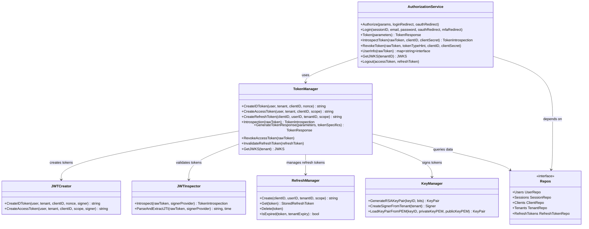
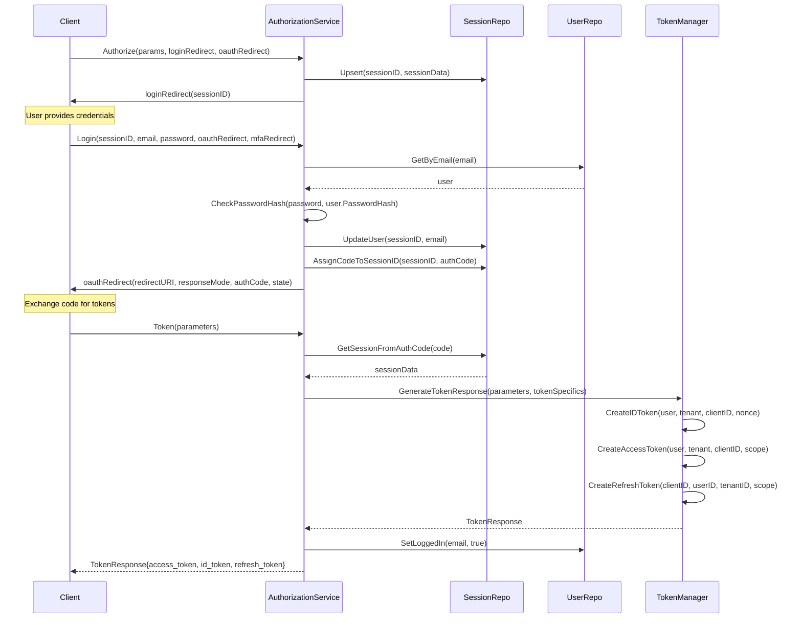
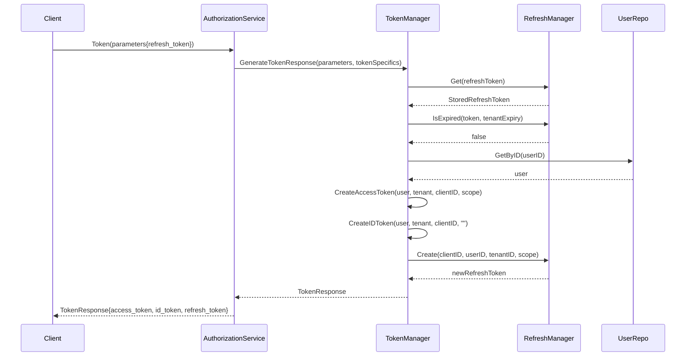
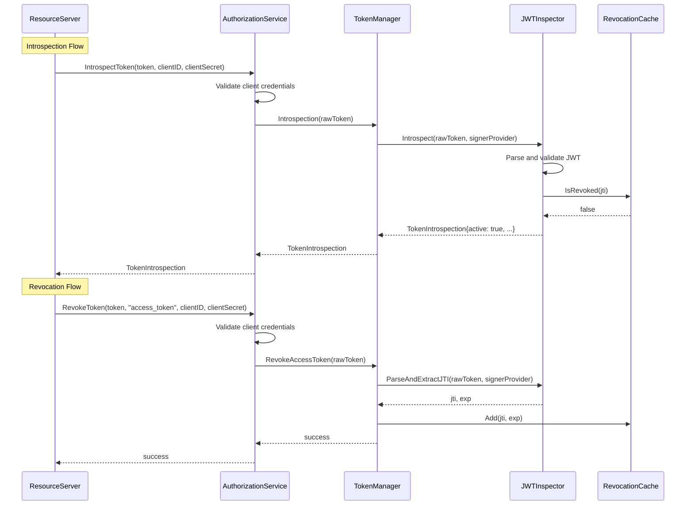

# 🔐 Go OAuth Service

> **⚠️ Work in Progress**: This project is under active development and is not yet ready.

A multi-tenant **OAuth2** and **OpenID Connect (OIDC)** server implementation written in Go. This library provides the core business logic for OAuth2 authorization flows without HTTP endpoints, allowing you to integrate it with any web framework of your choice.

## Architecture

The service follows a clean, layered architecture with clear separation of concerns:

### Core Components

### Authorization Code Flow

### Refresh Token Flow

### Token Introspection & Revocation

## License

This project is licensed under the MIT License - see the [LICENSE](LICENSE) file for details.

## Contributing

Contributions are welcome! Please feel free to submit a Pull Request.

## Contact

For questions and support, please open an issue on GitHub.

---

**Note**: This library provides the core OAuth2/OIDC logic. You'll need to implement HTTP endpoints, database repositories, and deployment configuration for a complete solution.
