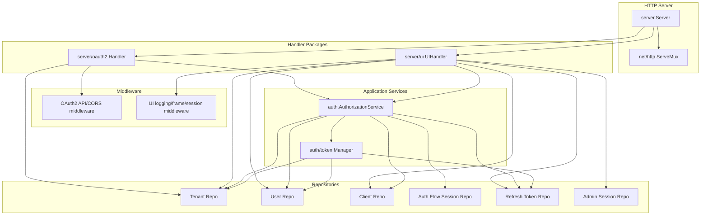
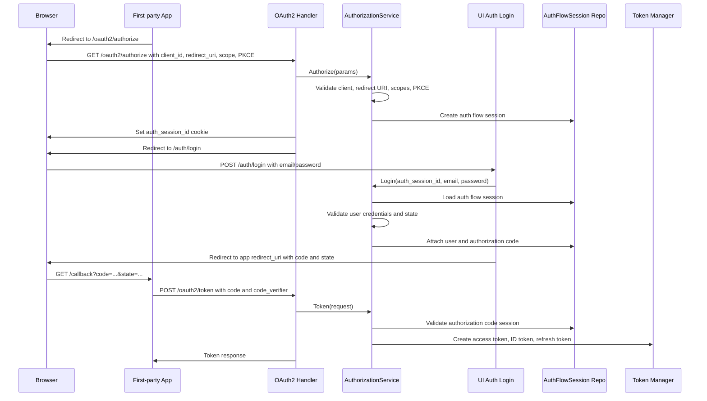
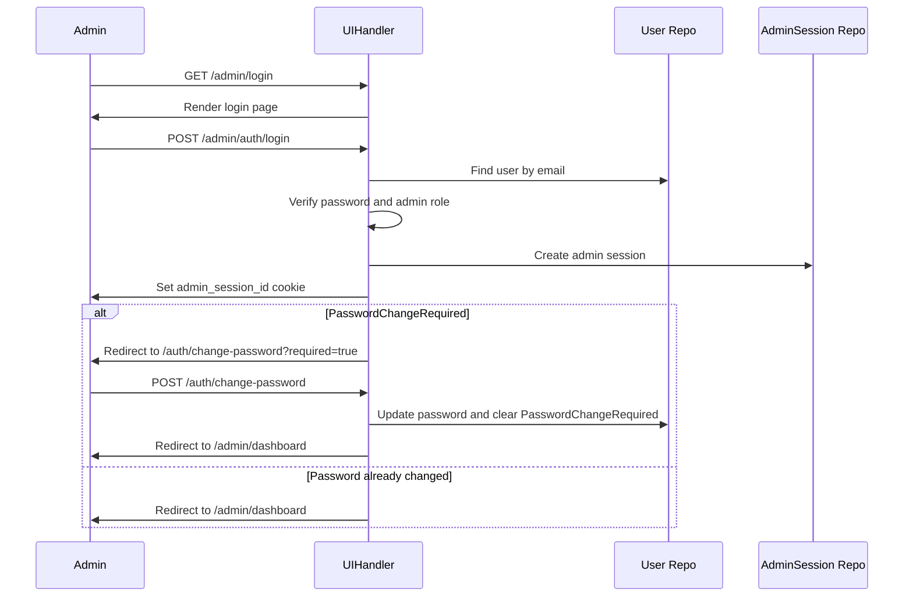

# Go OAuth Service

> Work in progress: this server is under active development. It is not production-ready yet.

This project is a multi-tenant OAuth2/OpenID Connect login service written in Go. The current shape is:

- An OAuth2/OIDC provider for first-party apps.
- A server-rendered admin UI for configuring tenants, clients, users, and settings.
- A separate admin UI session model, distinct from OAuth authorization-flow state.

The UI exists and supports admin login, but it still needs product/design and workflow work.

## Current Status

### Supported

- Multi-tenant issuer discovery from the request host.
- OIDC discovery document.
- JWKS endpoint using tenant signing keys.
- OAuth2 authorization code flow.
- PKCE validation with `S256` and `plain`.
- Token endpoint for:
  - authorization code
  - refresh token
  - client credentials
- JWT access tokens.
- OIDC ID tokens.
- Opaque refresh tokens stored server-side.
- UserInfo endpoint.
- Token introspection.
- Token revocation.
- OAuth browser login at `/auth/login`.
- Admin UI login at `/admin/login` using an opaque `admin_session_id` cookie.
- Default system tenant, admin OAuth client, and super-admin bootstrap.
- Forced first-login password change for the default super-admin user.

### Not Supported Yet

- OAuth/OIDC logout or end-session endpoint.
- `response_mode=form_post`.
- Normal browser SSO session for app users across multiple `/oauth2/authorize` requests.
- MFA flow completion.
- Forgot-password/reset-password email flow.
- Self-service signup.
- Persistent/shared admin UI sessions. Admin sessions are currently in-memory.
- Production hardening around CSRF, rate limiting, audit logging, lockout policy, and session management.

### Intentionally Out of Scope for Now

- Consent screens and persisted user grants.
- Third-party OAuth client approval flows.

This server is intended as a login service for first-party apps. Consent should only be added if third-party client support becomes a goal.

## Architecture


```mermaid
graph TB
    subgraph "HTTP Server"
        Server[server.Server]
        Router[net/http ServeMux]
    end

    subgraph "Handler Packages"
        OAuthHandlers[server/oauth2 Handler]
        UIHandlers[server/ui UIHandler]
    end

    subgraph "Middleware"
        OAuthMiddleware[OAuth2 API/CORS middleware]
        UIMiddleware[UI logging/frame/session middleware]
    end

    subgraph "Application Services"
        AuthService[auth.AuthorizationService]
        TokenManager[auth/token Manager]
    end

    subgraph "Repositories"
        Tenants[Tenant Repo]
        Users[User Repo]
        Clients[Client Repo]
        AuthFlowSessions[Auth Flow Session Repo]
        RefreshTokens[Refresh Token Repo]
        AdminSessions[Admin Session Repo]
    end

    Server --> Router
    Server --> OAuthHandlers
    Server --> UIHandlers

    OAuthHandlers --> OAuthMiddleware
    OAuthHandlers --> AuthService
    OAuthHandlers --> Tenants

    UIHandlers --> UIMiddleware
    UIHandlers --> AuthService
    UIHandlers --> Tenants
    UIHandlers --> Users
    UIHandlers --> Clients
    UIHandlers --> RefreshTokens
    UIHandlers --> AdminSessions

    AuthService --> TokenManager
    AuthService --> Tenants
    AuthService --> Users
    AuthService --> Clients
    AuthService --> AuthFlowSessions
    AuthService --> RefreshTokens

    TokenManager --> Tenants
    TokenManager --> Users
    TokenManager --> RefreshTokens
```

## Route Groups

`server.Server` delegates route registration to handler objects:

```go
func (s *Server) initRoutes() {
    s.uiHandlers.InitRoutes(s.RegisterRouteHandler)
    s.oauth2Handlers.InitRoutes(s.RegisterRouteHandler)
}
```

### OAuth2/OIDC Routes

Registered by `server/oauth2`:

| Method | Path | Status |
|---|---|---|
| `GET` | `/.well-known/openid-configuration` | Supported |
| `GET` | `/.well-known/jwks.json` | Supported |
| `GET` | `/oauth2/authorize` | Supported |
| `POST` | `/oauth2/token` | Supported |
| `GET` | `/userinfo` | Supported |
| `POST` | `/oauth2/introspect` | Supported |
| `POST` | `/oauth2/revoke` | Supported |

### OAuth Browser Login Routes

Registered by `server/ui`, used by `/oauth2/authorize`:

| Method | Path | Status |
|---|---|---|
| `GET` | `/auth/login` | Supported |
| `POST` | `/auth/login` | Supported |

### Admin UI Routes

Registered by `server/ui`:

| Method | Path | Status |
|---|---|---|
| `GET` | `/admin/login` | Supported |
| `POST` | `/admin/auth/login` | Supported |
| `GET` | `/admin/auth/logout` | Supported |
| `GET` | `/auth/change-password` | Supported for forced admin password change |
| `POST` | `/auth/change-password` | Supported for forced admin password change |
| `GET` | `/admin/dashboard` | Present, needs UI/workflow work |
| `GET` | `/admin/tenants` | Present, needs UI/workflow work |
| `GET` | `/admin/clients` | Present, needs UI/workflow work |
| `GET` | `/admin/users` | Placeholder |
| `GET` | `/admin/settings` | Placeholder |
| `GET` | `/admin/profile` | Placeholder |

## OAuth Authorization Code Flow


```mermaid
sequenceDiagram
    participant Browser
    participant App as First-party App
    participant OAuth as OAuth2 Handler
    participant Auth as AuthorizationService
    participant UI as UI Auth Login
    participant Sessions as AuthFlowSession Repo
    participant Tokens as Token Manager

    App->>Browser: Redirect to /oauth2/authorize
    Browser->>OAuth: GET /oauth2/authorize with client_id, redirect_uri, scope, PKCE
    OAuth->>Auth: Authorize(params)
    Auth->>Auth: Validate client, redirect URI, scopes, PKCE
    Auth->>Sessions: Create auth flow session
    OAuth->>Browser: Set auth_session_id cookie
    OAuth->>Browser: Redirect to /auth/login

    Browser->>UI: POST /auth/login with email/password
    UI->>Auth: Login(auth_session_id, email, password)
    Auth->>Sessions: Load auth flow session
    Auth->>Auth: Validate user credentials and state
    Auth->>Sessions: Attach user and authorization code
    UI->>Browser: Redirect to app redirect_uri with code and state

    Browser->>App: GET /callback?code=...&state=...
    App->>OAuth: POST /oauth2/token with code and code_verifier
    OAuth->>Auth: Token(request)
    Auth->>Sessions: Validate authorization code session
    Auth->>Tokens: Create access token, ID token, refresh token
    OAuth->>App: Token response
```

## Admin Login Flow


```mermaid
sequenceDiagram
    participant Admin
    participant UI as UIHandler
    participant Users as User Repo
    participant Sessions as AdminSession Repo

    Admin->>UI: GET /admin/login
    UI->>Admin: Render login page
    Admin->>UI: POST /admin/auth/login
    UI->>Users: Find user by email
    UI->>UI: Verify password and admin role
    UI->>Sessions: Create admin session
    UI->>Admin: Set admin_session_id cookie

    alt PasswordChangeRequired
        UI->>Admin: Redirect to /auth/change-password?required=true
        Admin->>UI: POST /auth/change-password
        UI->>Users: Update password and clear PasswordChangeRequired
        UI->>Admin: Redirect to /admin/dashboard
    else Password already changed
        UI->>Admin: Redirect to /admin/dashboard
    end
```

## Session Types

| Session | Package | Purpose | Lifetime |
|---|---|---|---|
| OAuth auth-flow session | `auth/authflowsession` | Temporary state for one `/oauth2/authorize` transaction | Short TTL from OAuth config |
| Admin UI session | `server/ui/adminsession` | Logged-in admin browser session | In-memory, currently 12 hours |

There is intentionally no `server/loginsession` package now.

## OAuth2/OIDC Endpoints

### `GET /.well-known/openid-configuration`

Returns tenant-specific OIDC metadata based on the request host.

Current discovery advertises:

```json
{
  "response_types_supported": ["code"],
  "response_modes_supported": ["query", "fragment"],
  "grant_types_supported": ["authorization_code", "refresh_token", "client_credentials"],
  "code_challenge_methods_supported": ["S256", "plain"],
  "token_endpoint_auth_methods_supported": ["client_secret_post", "none"]
}
```

The metadata includes authorization, token, userinfo, JWKS, revocation, and introspection endpoint URLs. It does not advertise an end-session endpoint.

### `GET /.well-known/jwks.json`

Returns the tenant JWKS used to validate JWT signatures.

### `GET /oauth2/authorize`

Starts an authorization-code request.

Supported query parameters:

| Parameter | Required | Notes |
|---|---|---|
| `client_id` | Yes | OAuth client ID |
| `redirect_uri` | Yes | Must match the registered client redirect URI |
| `response_type` | Yes | Must be `code` |
| `response_mode` | No | `query` or `fragment`; defaults to query behavior |
| `scope` | Yes | Space-separated scopes |
| `state` | Recommended | CSRF protection value |
| `code_challenge` | Required for public clients | PKCE challenge |
| `code_challenge_method` | Required for public clients | `S256` or `plain` |
| `nonce` | Optional | Included in ID token |

If the user is not authenticated for the flow, the handler creates an auth-flow session, sets `auth_session_id`, and redirects to `/auth/login`.

### `POST /auth/login`

Completes the browser login step for an OAuth authorization request.

It reads `auth_session_id` from the form or cookie, validates credentials through `AuthorizationService.Login`, then redirects back to the client redirect URI with an authorization code.

### `POST /oauth2/token`

Exchanges credentials for tokens.

Supported grants:

- `authorization_code`
- `refresh_token`
- `client_credentials`

Content type is `application/x-www-form-urlencoded`.

### `GET /userinfo`

Returns OIDC user claims for a bearer access token.

### `POST /oauth2/introspect`

Validates and returns token metadata. Requires client credentials.

### `POST /oauth2/revoke`

Revokes access or refresh tokens. Requires client credentials.

## Scopes

| Scope | Meaning |
|---|---|
| `openid` | Request OIDC ID token behavior |
| `profile` | Request profile claims |
| `email` | Request email claims |
| `offline_access` | Request refresh token behavior |
| `admin` | Tenant admin scope |
| `system:admin` | System admin scope |

## Bootstrap Behavior

On startup the server ensures:

- the system tenant exists
- the admin dashboard OAuth client exists
- a default super-admin user exists

The default super-admin is created with `PasswordChangeRequired = true`, so the first admin UI login redirects to `/auth/change-password?required=true`.

## Known Gaps

- Admin UI pages exist but are rough and incomplete.
- Admin sessions are in-memory only.
- There is no normal app-user SSO browser session yet, so `/auth/login` is tied to a single OAuth authorization flow.
- Consent screens are intentionally out of scope while this is first-party-app login only.
- There is no OAuth logout/end-session route.
- There is no `form_post` response mode.
- There is no callback-state or login-session package; both were removed as unused legacy paths.
- Password reset, signup, email verification, and MFA are not implemented.

## Development

Run tests with:

```sh
go test ./...
```

In restricted environments, use a writable Go cache:

```sh
GOCACHE=/private/tmp/go-oauth-service-go-build-cache go test ./...
```

## License

This project is licensed under the MIT License. See [LICENSE](LICENSE).
